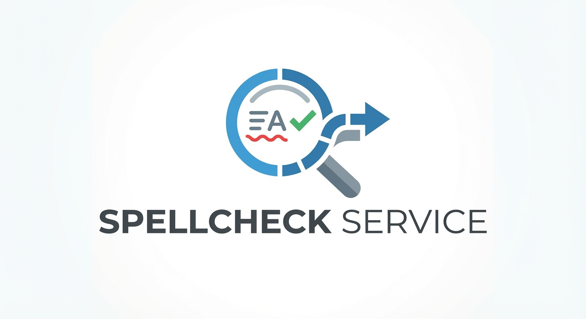

# SpellChecker Service



A containerised spell checker for short form text, written in Go.

## Features

- **Fast**: Single-pass tokenization, sub-millisecond response times
- **Accurate**: Uses SymSpell for fuzzy matching with 94,000+ word dictionary
- **Profile-based**: Different allowlists for different use cases (BBC News, default, etc.)
- **Smart tokenization**: Handles contractions, hyphenated words, acronyms, URLs, emails, quoted text
- **Repeated word detection**: Catches "the the" automatically
- **Capitalisation checking**: Detects lowercase words after sentence-ending punctuation
- **Quote handling**: Supports straight and curly/smart quotes
- **Hot reload**: Profile changes take effect immediately without restart
- **Base64 support**: Send complex text with special characters easily
- **Web UI**: React-based webapp for easy spell checking

## Quick Start

### Using Docker Compose (Recommended)

```bash
# Clone the repository
git clone <repository-url>
cd SpellChecker

# Build and run both backend and webapp (with port checking)
./start.sh

# Or use docker-compose directly:
docker-compose up -d

# Access the webapp
# Open http://localhost:3000 in your browser

# View logs
docker-compose logs -f

# Stop
docker-compose down
```

**Note on Port Conflicts:** The services use ports 8080 (backend) and 3000 (frontend). If these ports are already in use, the `./start.sh` script will warn you. You can either:
1. Stop the conflicting services
2. Or modify the port mappings in `docker-compose.yaml`

**Services:**
- Backend API: http://localhost:8080
- Web UI: http://localhost:3000

### Production Deployment

For production deployments with a single container (recommended):

```bash
# Build production image
docker build -f Dockerfile.prod -t spellchecker:latest .

# Run (single port serves both UI and API)
docker run -d -p 8080:8080 spellchecker:latest

# Access at http://localhost:8080
```

See [DEPLOYMENT.md](docs/DEPLOYMENT.md) for detailed deployment options.

### Using Docker (API Only)

```bash
# Build image
docker build -t spellchecker .

# Run container
docker run -d -p 8080:8080 --name spellchecker spellchecker

# Check health
curl http://localhost:8080/health
```

### Using Go

```bash
# Install dependencies
go mod download

# Run in development mode
go run cmd/server/main.go

# Or build and run
go build -o server ./cmd/server
./server
```

### Using CLI

```bash
# Build the CLI
go build -o spellcheck-cli ./cmd/cli

# Check text from command line
./spellcheck-cli check "The goverment announced a new partnership"

# Check text from file
./spellcheck-cli check --file article.txt

# Check with specific profile
./spellcheck-cli check --profile bbc-news "The MPs debated Brexit"

# List available profiles
./spellcheck-cli profiles

# Validate configuration
./spellcheck-cli validate
```

See [CLI Documentation](docs/CLI.md) for detailed usage.

## API Usage

### Check Text for Misspellings

```bash
curl -X POST http://localhost:8080/check \
  -H "Content-Type: application/json" \
  -d '{
    "text": "The goverment announced a new partnership"
  }'
```

**Response:**

```json
{
  "misspellings": [
    {
      "word": "goverment",
      "offset": 4,
      "line": 1,
      "column": 5,
      "suggestions": [{ "word": "government", "edit_distance": 1 }]
    }
  ],
  "repeated_words": [],
  "token_count": 11,
  "checked_count": 6,
  "elapsed_ms": 0.5
}
```

### Text with Quotes (using Base64)

```bash
# Encode text with quotes
echo -n 'He said "hello world" to me' | base64

# Send request
curl -X POST http://localhost:8080/check \
  -H "Content-Type: application/json" \
  -d '{
    "text_base64": "SGUgc2FpZCAiaGVsbG8gd29ybGQiIHRvIG1l"
  }'
```

### Interactive API Documentation

Open `http://localhost:8080/docs` in your browser for Swagger UI.

## Documentation

- **[API Documentation](docs/API.md)** - Complete API reference with examples
- **[CLI Documentation](docs/CLI.md)** - Command-line interface usage guide
- **[Architecture Overview](docs/ARCHITECTURE.md)** - System design and data flow
- **[Deployment Guide](docs/DEPLOYMENT.md)** - Production deployment options
- **[Developer Guide](docs/DEVELOPER.md)** - Contributing and development setup
- **[TODO](docs/TODO.md)** - Roadmap and future features

## Environment Variables

| Variable              | Default                       | Description                             |
| --------------------- | ----------------------------- | --------------------------------------- |
| `DICT_PATH`           | `/dictionaries/en_gb.txt`     | Path to the dictionary word list        |
| `BASE_ALLOWLIST_PATH` | `/config/base-allowlist.yaml` | Path to the allowlist configuration     |
| `PROFILES_DIR`        | `/config/profiles`            | Directory containing profile YAML files |
| `LISTEN_ADDR`         | `:8080`                       | HTTP server bind address                |

## Testing

```bash
# Run all tests
go test ./...

# Run with coverage
go test -cover ./...

# Run benchmarks
go test -bench=. ./internal/tokenizer

# Run test harness for real-world examples
cd harness && go run .
```

## Project Structure

```
SpellChecker/
├── cmd/
│   └── server/
│       └── main.go              # Application entry point
├── internal/
│   ├── tokenizer/               # Text tokenization
│   │   ├── scanner.go           # State machine scanner
│   │   ├── token.go            # Token types
│   │   ├── skipzones.go        # URL/email detection
│   │   └── scanner_test.go
│   ├── checker/                 # Spell check core
│   │   ├── checker.go           # Pipeline orchestration
│   │   ├── checker_test.go
│   │   ├── pool.go              # Profile management
│   │   └── result.go            # Result types
│   ├── allowlist/               # Profile/allowlist management
│   │   ├── store.go
│   │   ├── profile.go
│   │   ├── watcher.go           # Hot reload
│   │   └── store_test.go
│   ├── dictionary/              # Dictionary loading
│   │   ├── loader.go
│   │   └── loader_test.go
│   └── api/                     # HTTP API layer
│       ├── handler.go
│       ├── handler_test.go
│       ├── request.go
│       └── swagger.go
├── config/
│   ├── profiles/                # Profile configurations
│   │   ├── bbc-news.yaml
│   │   ├── bbc-sport.yaml
│   │   └── default.yaml
│   └── base-allowlist.yaml      # Global allowed terms
├── dictionaries/
│   └── en_gb.txt                # Dictionary file
├── docs/                        # Documentation
│   ├── API.md
│   ├── ARCHITECTURE.md
│   ├── DEPLOYMENT.md
│   ├── DEVELOPER.md
│   └── TODO.md
├── harness/                     # Test harness
│   ├── fixtures.json
│   ├── main.go
│   └── demo_results.html
├── webapp/                      # React web application
│   ├── src/
│   ├── package.json
│   └── Dockerfile
├── Dockerfile
├── docker-compose.yaml
└── README.md
```

## Features in Detail

### Token Types

The tokenizer handles various text elements:

- **Words** - Standard words (spell-checked)
- **Contractions** - "don't", "can't" (checked as units)
- **Hyphenated** - "well-known" (components checked separately)
- **Acronyms** - "BBC", "HTML" (skipped)
- **Numbers** - "42", "3.14" (skipped)
- **URLs** - "https://..." (skipped)
- **Emails** - "a@b.com" (skipped)
- **Quoted text** - Text in quotes (skipped)

### Profile-Based Allowlists

Different profiles can have different allowed terms:

```yaml
# config/profiles/bbc-news.yaml
profile_id: bbc-news
description: "BBC News style profile"
terms:
  - Brexit
  - Westminster
  - Downing Street
```

### Repeated Word Detection

Automatically catches words that appear twice in a row:

```json
{
  "repeated_words": [
    {
      "word": "the",
      "offset": 4,
      "line": 1,
      "column": 5
    }
  ]
}
```

## Contributing

See [Developer Guide](docs/DEVELOPER.md) for contribution guidelines.
